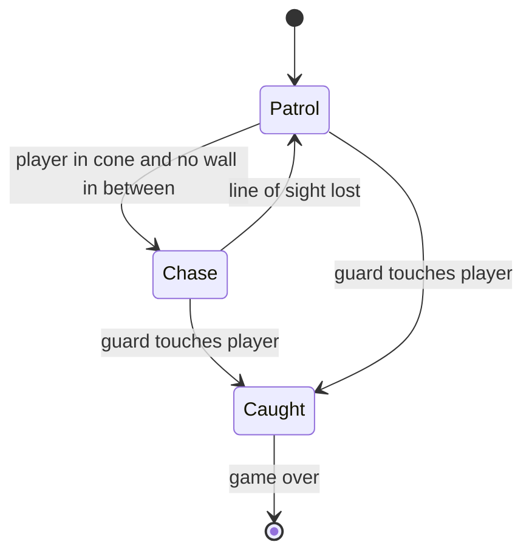
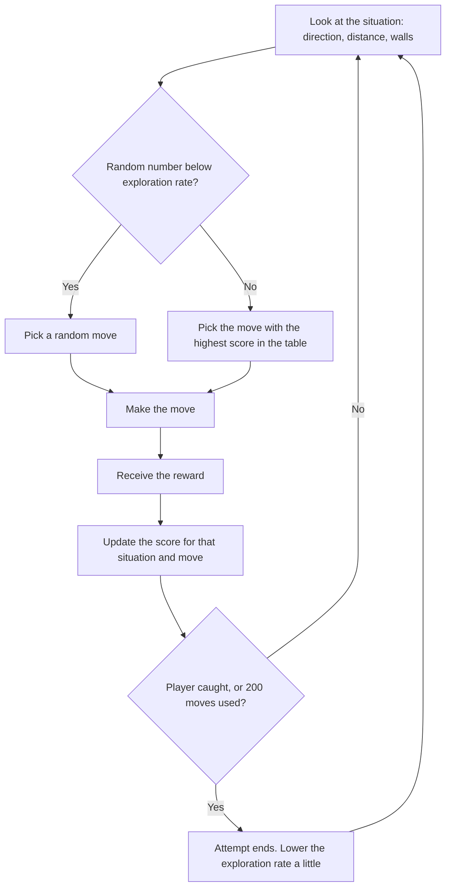

# Design — The Witness

- **Client:** Nightfall Interactive
- **Made by:** David Eslava — Fontys ICT Student
- **Version 0.1 — 23 September 2026**

---

## 1. Introduction

This document describes how The Witness is built. It follows from the requirements in the [[The Witness - Analysis  0.2|Analysis]] and from the decisions in the [[Advice - engine and AI choice|Advice]] document: the game is made in Godot 4 with GDScript, the guards use a state machine, and The Hunter uses tabular Q-learning.

The document has two parts:

- **What the prototype builds** (sections 2 to 5): the tools, the level, the scene structure and the guards.
- **What is designed but not built** (section 6): The Hunter, including how its improvement would be measured. The Analysis explains why it is not built in this delivery.

## 2. Technical choices

### 2.1 Tools

| Tool | Used for | Why (details in the Advice document) |
|---|---|---|
| Godot 4 | Game engine | Free, all 2D tools built in |
| GDScript | All game code | Close to Python, built into Godot |
| Blender | Modelling and animating the player, rendering the sprites | Lets me make eight-direction sprites from one 3D model instead of drawing every frame |
| draw.io | Main flowchart | Free and easy to edit |
| Obsidian with Git | Documentation and version history | Everything lives in one vault that is backed up to GitHub |

### 2.2 Art direction

The game uses a noir comic-book look inspired by Frank Miller, with only three colours: black, white and red accents. Red is kept for danger, so the guards and their vision cones are the only red things on screen and the player can read the situation at a glance.

The player sprites are made in Blender. I modelled and animated the character in 3D (idle, walking, running, crouching and sneaking), then rendered each animation from eight directions as 1024 × 1024 images. This avoids frame-by-frame drawing, which I do not have the skills or the time for.

For the prototype, everything except the player is a placeholder: walls are black rectangles and guards are red squares, as agreed with my coach. Finished art comes after the gameplay works.

### 2.3 World scale

Because the player sprites are 1024 × 1024, the player is about 400 units across in the game world, and the camera is zoomed out to 0.3 so the character looks the right size on screen. Everything else in the level is sized relative to the player, so the placeholders fit the real sprites later without redoing the level:

| Thing | Size or speed |
|---|---|
| Player (collision circle) | radius 212, walks 200, crouches 100, runs 1000 |
| Guard (red square) | 360 × 360, patrols at 150, chases at 300 |
| Guard vision cone | 90 degrees wide, 1800 units long (about four player widths) |
| Guard catch area | circle, radius 200 |
| Walls | 100 units thick |
| Grid square (level layout and The Hunter) | 400 × 400, about one player width |

The guard chases faster than the player walks but slower than the player runs, so running away is always possible but has to be chosen.

## 3. Game flow

### 3.1 Main flowchart

The main flowchart shows the full game at a high level, from the title screen to victory or game over. Detailed diagrams are only made for the two systems complex enough to need them: the guards (section 5) and The Hunter (section 6).

![[Flowchart - The Witness.drawio.svg]]

The prototype builds the core of this flow: gameplay, detection by a guard, and game over with a retry. The title screen, comic introduction, alert levels and The Hunter's activation are part of the full game, not of this delivery.

### 3.2 Level layout

The level is one floor of the jazz club: a main room with a bar, a stage and tables, and a back corridor that leads to the exit. The player starts in the bottom left corner and has to reach the exit without being caught.

![[Level layout sketch.svg]]

The tables and the bar are there on purpose. Without something to hide behind, the vision cone cannot be tested, because there is nowhere for the player to break line of sight (requirement M-04).

The guard walks a fixed loop around the tables through four waypoints. The route is placed so that the straight line between two waypoints never crosses furniture, which keeps the guard from walking into things during its patrol (M-07). A second guard in the corridor is only added if time allows.

## 4. Architecture

### 4.1 Scene tree

In Godot a game is built from nodes arranged in a tree. This is the tree for the prototype level:

```
Game_The_Witness (Node2D)            the level
├── Walls (Node2D)
│   └── StaticBody2D × several       each with a CollisionShape2D and a black ColorRect
├── Furniture (Node2D)
│   └── StaticBody2D × several       bar, stage and tables, grey ColorRects
├── Player (player_character.tscn)
│   └── Camera2D                     zoom 0.3, child of the player so it follows them
├── PatrolRoute (Node2D)
│   └── Marker2D × 4                 the guard's waypoints
├── Enemy (enemy.tscn)
├── Exit (Area2D)                    reaching it ends the attempt as a win (built last)
└── GameOverScreen (CanvasLayer)     dark ColorRect and a Label, hidden until caught
```

And the guard, which is its own scene so it can be placed more than once:

```
Enemy (CharacterBody2D)              enemy.gd
├── ColorRect                        red square, placeholder
├── CollisionShape2D                 its body, collides with walls
├── Vision (Area2D)
│   └── CollisionPolygon2D           the vision cone
├── CatchArea (Area2D)
│   └── CollisionShape2D             small circle, touching the player = caught
└── SightLine (RayCast2D)            checks that no wall is between guard and player
```

Two details are deliberate. The camera is a child of the player, because the level is larger than one screen and the camera has to follow. `PatrolRoute` is not a child of the enemy, because child nodes move with their parent, and the waypoints would move with the guard and it would never reach them.

### 4.2 How the scripts work together

| Script | Attached to | What it does |
|---|---|---|
| `player_character.gd` | Player | Movement, crouching, running, and choosing the right animation for the direction |
| `enemy.gd` | Enemy | The guard's state machine (section 5) |
| `game_manager.gd` | Autoload, available everywhere as `GameManager` | Knows whether the game is over, pauses the game, restarts the level |
| `game_over_screen.gd` | GameOverScreen | Shows itself when the player is caught, restarts on Enter |

The guard does not talk to the game over screen directly. When it catches the player it calls `GameManager.catch_player()`. The game manager pauses the game and sends out a `player_caught` signal, and the game over screen listens for that signal. This keeps the pieces independent: a second guard, or The Hunter later, only needs to call the same function.

### 4.3 Collision layers

Godot decides what can touch what through collision layers. Each object is *on* a layer and *looks at* (masks) other layers.

| Object | Is on layer | Looks at |
|---|---|---|
| Walls and furniture | world | nothing |
| Player | player | world |
| Guard body | enemy | world |
| Guard vision cone | nothing | player |
| Guard catch area | nothing | player |
| Guard sight line | nothing | world and player |

The sight line has to look at both: it must hit walls to know they are in the way, and hit the player to know nothing is.

### 4.4 Coding conventions

- When a value has several possible options, such as the guard's state, it is an `enum` and is handled with `match` instead of a chain of `if` statements, following my coach's feedback.
- Speeds, ranges and turn rates are `@export` variables, so they can be tuned in the editor during playtesting without changing code.
- Each script starts with a short comment saying what it is for.

## 5. The guards

### 5.1 State machine

A guard is always in exactly one of three states:



- **Patrol:** walk to the next waypoint, and when it is reached, go to the one after. After the last waypoint it starts again from the first.
- **Chase:** walk straight towards the player at chase speed.
- **Caught:** stand still. The game manager takes over.

The guard always turns to face the direction it walks in, and the vision cone turns with it.

### 5.2 How detection works

Seeing the player takes two checks, because one is not enough:

1. **Is the player inside the cone?** The `Vision` area reports when the player enters or leaves it. This covers range and angle, but an area in Godot does not know about walls. On its own, the guard would see through the bar.
2. **Is anything in the way?** While the player is inside the cone, the `SightLine` raycast is pointed at the player every frame. If the first thing it hits is the player, the guard sees them. If it hits a wall or furniture first, it does not.

The guard only switches to Chase when both are true. This is what makes hiding behind cover work (M-06).

### 5.3 Known risk

When a guard loses sight of the player during a chase, it walks straight back towards its next waypoint. If furniture is in the way it slides along it instead of walking around it. If playtesting shows guards getting stuck, the fix is Godot's built-in pathfinding (NavigationAgent2D) in the Chase and return-to-patrol movement, as mentioned in the Advice document. This is tested in the Validation.

## 6. The Hunter (designed, not built in this delivery)

The Hunter is the boss's right-hand man and the enemy the client's question is about. Unlike the guards, it has no route. It decides every move itself and gets better at it over many attempts. This section describes it in enough detail to build it in the next iteration.

### 6.1 How Q-learning works, in short

The Hunter keeps a table. Each row is a situation it can be in, each column is a move it can make, and each cell holds a number: how good that move has turned out to be in that situation so far. At the start all numbers are zero, so it moves more or less randomly. After every move it gets a reward or a penalty and updates the number for the move it just made. Over many attempts, moves that led towards the player get higher numbers, and the Hunter picks those more often.

### 6.2 What The Hunter perceives (the state)

The Hunter does not see the whole map. It moves on the grid from section 2.3 and knows only this:

| What it knows | Possible values | Count |
|---|---|---|
| Direction to the player | N, NE, E, SE, S, SW, W, NW | 8 |
| Distance to the player | close (1–2 squares), medium (3–5), far (6 or more) | 3 |
| Is there a wall directly up, down, left, right? | yes or no, for each of the four | 16 |

That gives 8 × 3 × 16 = **384 situations**.

The wall information was not in my first version of this design, which only used direction and distance. I added it because the reward in 6.4 punishes walking into walls, and the Hunter cannot learn to avoid something it cannot perceive. Without it, the same situation would sometimes have a wall next to it and sometimes not, and the table would never settle.

### 6.3 What The Hunter can do (the actions)

Four moves, one square at a time: **up, down, left, right**.

With 384 situations and 4 moves, the whole table has 1,536 numbers. That is small enough to learn quickly and to open and read when something looks wrong.

### 6.4 How it is rewarded

| What happened after the move | Reward |
|---|---|
| Caught the player | +50, and the attempt ends |
| Got closer to the player | +1 |
| Stayed at the same distance | −0.1 |
| Got further from the player | −1 |
| Walked into a wall (and did not move) | −5 |

The small penalty for staying at the same distance stops the Hunter from learning to wander sideways forever. The catch reward is much larger than the others, so catching is always worth more than a series of small steps.

%% TO DO David: these reward numbers are a starting point. The ratios matter more than the exact values: catching must be worth much more than one step, and hitting a wall must hurt more than moving away. %%

### 6.5 How it learns

After each move, the number in the table for that situation and move is updated:

*new value = old value + learning rate × (reward + discount × best value in the new situation − old value)*

In plain words: the move's score moves a little towards "the reward I just got, plus how good my new situation looks". The settings I would start with:

| Setting | Value | What it means |
|---|---|---|
| Learning rate | 0.1 | Each new experience changes the score by 10 percent, so one lucky move does not rewrite the table |
| Discount | 0.9 | A catch a few moves away still counts, so the Hunter learns to plan a little ahead |
| Exploration | starts at 1.0, lowered to 0.05 over training | At first it tries random moves to discover what works; later it mostly uses what it learned, with a small chance of trying something new |



An attempt ends when the Hunter catches the player or after 200 moves, so a Hunter that never finds the player does not run forever.

### 6.6 Training

Training against a human would take hundreds of attempts, so the Hunter first trains against a simple scripted runner in a copy of the level: a stand-in player that moves away from the Hunter along random routes. Godot can run this much faster than real time. The table is saved to a file after training, so the trained Hunter can be loaded into the real game, where it keeps learning from the actual player.

### 6.7 How improvement would be measured

This is the part that answers the client's question, so it is defined before anything is built.

**What is recorded in every attempt:**

- the number of moves the Hunter needed to catch the player, or 200 if it failed
- whether it caught the player within 200 moves
- how many times it walked into a wall

**The comparison:**

1. Run 50 attempts with an **untrained** Hunter (a table of zeros, so it moves randomly), from 10 fixed starting positions.
2. Train the Hunter for 500 attempts against the scripted runner.
3. Run the same 50 attempts with the **trained** Hunter, with exploration switched off so it only uses what it learned.
4. Compare the averages, and plot moves-to-catch over the 500 training attempts as a learning curve.

**When it counts as improved:** the trained Hunter needs clearly fewer moves on average than the untrained one, catches the player more often within 200 moves, and the learning curve goes down instead of staying flat. If it does not, that result is reported as it is, as the Analysis promises.

**What players notice:** the client also wants to know whether the improvement is *visible*. After five attempts against the Hunter, playtesters are asked one question: "Did the Hunter get better at finding you?" A Hunter that improves in the numbers but not in the player's experience would not be worth marketing.

%% TO DO David: 50 attempts, 500 training attempts and 10 starting positions are my first estimate. Check with Frank whether this is enough. %%

### 6.8 Limits of this design

- The Hunter only knows the direction of the player and the walls right next to it, not the layout of the whole level. It can learn "go around the wall on the left when the player is north-east", but not a route through several rooms.
- It learns against one kind of runner. If real players behave very differently, it will need time to adjust.

Both are acceptable for a first learning enemy. They are also the first things to improve in a later version.

## 7. Requirements and where they are designed

| Requirement | Where it is designed |
|---|---|
| M-01 Play the game | 3.1 Main flowchart, 4.1 Scene tree |
| M-02 Move in eight directions | 4.2 `player_character.gd` |
| M-03 Cannot walk through walls | 4.3 Collision layers |
| M-04 Use cover | 3.2 Level layout |
| M-05 Enemies that move | 5.1 Patrol state |
| M-06 Only seen inside the cone | 5.2 How detection works |
| M-07 Enemies walk around walls | 3.2 Level layout, 5.3 Known risk |
| M-08 Told when caught | 4.2 Game manager and game over screen |
| C-01 Enemy that gets better | 6 The Hunter |

The [[Validation]] document tests each Must Have against this design.
