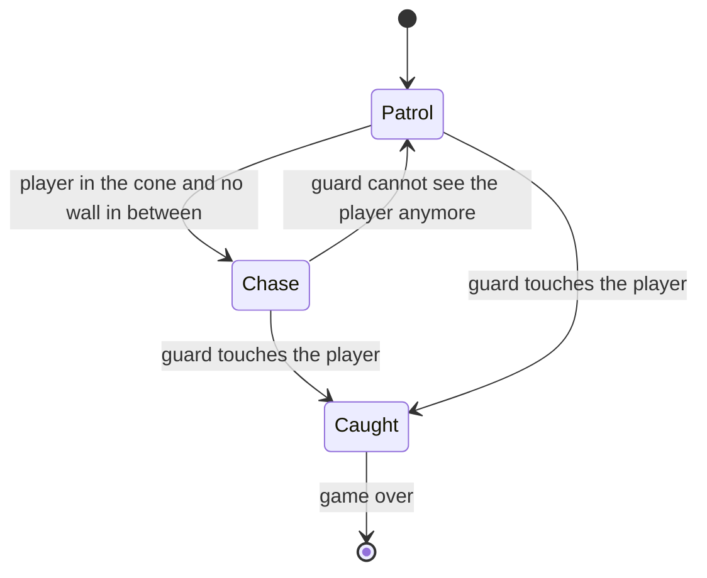
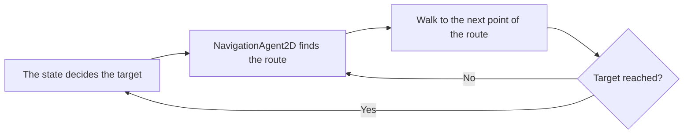
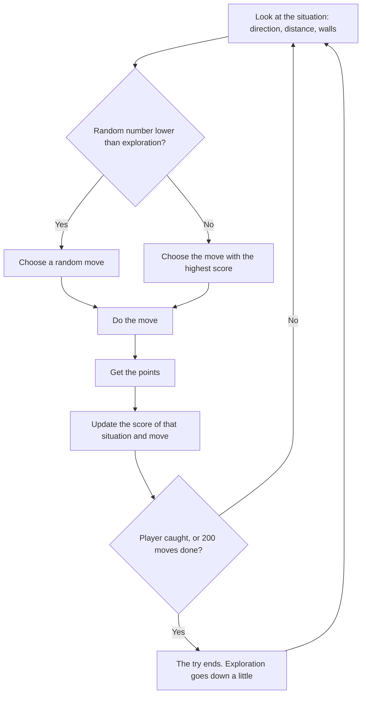

# Design — The Witness

- **Client:** Nightfall Interactive
- **Made by:** David Eslava - Fontys ICT Student
- **Version 0.1 — 23 September 2026**

---

## 1. Introduction

In this document I explain how I build The Witness. It is based on the requirements in the [[The Witness - Analysis  0.2|Analysis]] and on the decisions in the [[Advice - engine and AI choice|Advice]] document:

- The game is made in Godot 4 with GDScript.
- The guards use the pathfinding of Godot to move, and a few simple rules to decide where to go.
- The Hunter uses Q-learning with a table.

The document has two parts:

- **What I build in the prototype** (sections 2 to 5): the tools, the level, the nodes and the guards.
- **What I design but do not build yet** (section 6): The Hunter, and how to measure if it gets better. The Analysis explains why I do not build it in this delivery.

## 2. Technical choices

### 2.1 Tools

| Tool | What I use it for | Why (more in the Advice document) |
|---|---|---|
| Godot 4 | Game engine | Free, all 2D tools included |
| GDScript | All the code of the game | Similar to Python, included in Godot |
| Blender | Making and animating the player in 3D, and rendering the sprites | I can make sprites in eight directions from one 3D model, so I don't have to draw every frame |
| draw.io | Main flowchart | Free and easy to change |
| Obsidian with Git | Documents and version history | Everything is in one vault with a backup on GitHub |

### 2.2 Art style

The game has a noir comic style, inspired by Frank Miller. It only uses three colours: black, white and red. Red is only for danger, so the guards and their vision cones are the only red things on the screen. The player can see quickly where the danger is.

I make the player sprites in Blender. I made the character in 3D and animated it (idle, walking, running, crouching and sneaking). Then I rendered every animation from eight directions as images of 1024 × 1024. Like this I don't need to draw frame by frame, because I don't have the skills or the time for that.

In the prototype, everything except the player is a placeholder: the walls are black rectangles and the guards are red squares, like my coach told me. The final art comes after the gameplay works.

### 2.3 Size of the world

The player sprites are 1024 × 1024, so the player is around 400 units wide in the game. The camera has a zoom of 0.3, so the player looks the right size on the screen. I make everything else in the level with the size of the player in mind. Like this, the placeholders still fit when I put the real sprites.

| What | Size or speed |
|---|---|
| Player (collision circle) | radius 212, walks at 200, crouches at 100, runs at 1000 |
| Guard (red square) | 360 × 360, patrols at 150, chases at 300 |
| Vision cone of the guard | 90 degrees wide, 1800 units long (around four times the player) |
| Catch area of the guard | circle, radius 200 |
| Space the guard keeps from walls (pathfinding) | 200 |
| Walls | 100 units thick |
| One square of the grid (level and The Hunter) | 400 × 400, around the size of the player |

The guard chases faster than the player walks, but slower than the player runs. So the player can always escape, but they have to choose to run.

## 3. Game flow

### 3.1 Main flowchart

The main flowchart shows the whole game in a simple way, from the title screen to winning or game over. I only make detailed diagrams for the two parts that are complex: the guards (section 5) and The Hunter (section 6).

![[Flowchart - The Witness.drawio.svg]]

The prototype has the main part of this flow: playing, being seen by a guard, and game over with the option to try again. The title screen, the comic introduction, the alert levels and The Hunter are part of the full game, not of this delivery.

### 3.2 Level layout

The level is one floor of the jazz club. It has a main room with a bar, a stage and tables, and a back corridor that goes to the exit. The player starts in the bottom left corner and has to get to the exit without being caught.

![[Level layout sketch.svg]]

I put the tables and the bar there on purpose. Without things to hide behind, I cannot test the vision cone, because the player has no way to break the line of sight (requirement M-04).

The guard walks in a loop around the tables with four waypoints. All the floor except the walls and the furniture is marked as a place where the guard can walk. So the guard finds its own way around the tables, when it patrols and when it chases (M-07). A second guard in the corridor is only for if I have time.

## 4. Architecture

### 4.1 Scene tree

In Godot a game is made with nodes in a tree. This is the tree of the level in the prototype:

```
Game_The_Witness (Node2D)            the level
├── NavigationRegion2D                the floor where guards can walk
│   ├── Walls (Node2D)
│   │   └── StaticBody2D × several   each one with a CollisionShape2D and a black ColorRect
│   └── Furniture (Node2D)
│       └── StaticBody2D × several   bar, stage and tables, grey ColorRects
├── Player (player_character.tscn)
│   └── Camera2D                     zoom 0.3, child of the player so it follows them
├── PatrolRoute (Node2D)
│   └── Marker2D × 4                 the waypoints of the guard
├── Enemy (enemy.tscn)
├── Exit (Area2D)                    if the player gets here, they win (I build it last)
└── GameOverScreen (CanvasLayer)     dark ColorRect and a Label, hidden until you are caught
```

The guard has its own scene, so I can put more than one guard in the level:

```
Enemy (CharacterBody2D)              enemy.gd
├── ColorRect                        red square, placeholder
├── CollisionShape2D                 its body, it collides with walls
├── Vision (Area2D)
│   └── CollisionPolygon2D           the vision cone
├── CatchArea (Area2D)
│   └── CollisionShape2D             small circle, if it touches the player, the player is caught
├── SightLine (RayCast2D)            checks if there is a wall between the guard and the player
└── NavigationAgent2D                finds the way to the place the guard wants to go
```

Some things are like this on purpose:

- The walls and the furniture are inside the `NavigationRegion2D`. Godot only cuts out the obstacles that are inside the region. If they are outside, the guard does not know they are there.
- The camera is a child of the player. The level is bigger than the screen, so the camera has to follow the player.
- `PatrolRoute` is not a child of the enemy. A child moves together with its parent, so the waypoints would move with the guard and it would never reach them.

### 4.2 How the scripts work together

| Script                | On which node                                             | What it does                                                                        |
| --------------------- | --------------------------------------------------------- | ----------------------------------------------------------------------------------- |
| `player_character.gd` | Player                                                    | Movement, crouching, running, and the right animation for each direction            |
| `enemy.gd`            | Enemy                                                     | Decides where the guard wants to go and moves it there with pathfinding (section 5) |
| `game_manager.gd`     | Autoload, you can use it from everywhere as `GameManager` | Knows if the game is over, pauses the game, restarts the level                      |
| `game_over_screen.gd` | GameOverScreen                                            | Appears when the player is caught, restarts when you press Enter                    |

The guard does not talk directly to the game over screen. When the guard catches the player, it calls `GameManager.catch_player()`. The game manager pauses the game and sends a signal called `player_caught`. The game over screen listens to that signal and appears. Like this every part works on its own: a second guard, or The Hunter later, only has to call the same function.

### 4.3 Collision layers

In Godot, collision layers decide what can touch what. Every object is *on* a layer, and it *looks at* (mask) other layers.

| Object | On layer | Looks at |
|---|---|---|
| Walls and furniture | world | nothing |
| Player | player | world |
| Body of the guard | enemy | world |
| Vision cone of the guard | nothing | player |
| Catch area of the guard | nothing | player |
| Sight line of the guard | nothing | world and player |

The sight line has to look at both. It has to hit the walls to know that a wall is in the way, and it has to hit the player to know that nothing is in the way.

### 4.4 How I write the code

- When something has different options, like the state of the guard, I use an `enum` and a `match`, not a lot of `if`. This was feedback from my coach.
- Speeds, distances and turn speed are `@export` variables. Like this I can change them in the editor when I test the game, without changing the code.
- Every script starts with a short comment that explains what it is for.

## 5. The guards

A guard does two different things:

- **Decide where to go:** to the next patrol point, or to the player. For this I use a few simple rules (5.1).
- **Get there:** walk around the bar, the stage and the tables to get to that point. For this I use pathfinding (5.2).

### 5.1 Deciding where to go

A guard is always in one of three states. Every state gives the guard a target:



| State | Target | Speed |
|---|---|---|
| **Patrol** | The next waypoint. When it gets there, the next one. After the last one, it starts again with the first | 150 |
| **Chase** | Where the player is now, updated every frame | 300 |
| **Caught** | No target, the guard stops and the game manager does the rest | 0 |

The guard always turns to the direction it walks, and the vision cone turns with it.

If I have time, the first thing I add is a **Search** state (Should Have S-03). When the guard loses the player, it goes to the last place where it saw them, looks around for a few seconds, and then goes back to its patrol. Because the pathfinding is already there, this is only a new target, not new movement code.

### 5.2 Getting there: pathfinding

The guards use the navigation of Godot, like I recommend in the Advice document:

1. **The floor where guards can walk.** A `NavigationRegion2D` covers the level. I draw the outline of the whole floor and I press *Bake*. Godot cuts out the walls and the furniture, and leaves 200 units of space around them (the size of the guard). The result is a map of every place where a guard can stand.
2. **The route.** Every guard has a `NavigationAgent2D`. The script gives it a target (from the table in 5.1), and the agent gives back the next point of the shortest way around the obstacles. The guard walks to that point, and when it gets there, it asks for the next one.



So I can put the waypoints anywhere on the floor, and a guard that chases the player walks around a table, not into it (M-07).

### 5.3 How the guard sees the player

The guard needs two checks to see the player, because one check is not enough:

1. **Is the player inside the cone?** The `Vision` area tells the script when the player goes in or out of the cone. This checks the distance and the angle. But an area in Godot does not know about walls, so with only this check the guard could see through the bar.
2. **Is there something in the way?** When the player is inside the cone, the `SightLine` raycast points at the player every frame. If the first thing it hits is the player, the guard sees them. If it hits a wall or furniture first, the guard does not see them.

The guard only starts to chase when both checks are true. This is what makes hiding behind things work (M-06).

## 6. The Hunter (designed, not built in this delivery)

The Hunter is the right-hand man of the boss, and he is the enemy the client wants to test. He is different from the guards: he has no route. He decides every move himself, and he gets better after many tries. In this section I describe him with enough detail to build him in the next iteration.

### 6.1 How Q-learning works

The Hunter has a table. Every row is a situation, every column is a move, and in every cell there is a number: how good that move was in that situation until now. At the start all the numbers are zero, so he moves more or less at random. After every move he gets points or loses points, and he changes the number of the move he just did. After many tries, the moves that bring him closer to the player have higher numbers, and he chooses them more often.

### 6.2 What The Hunter knows (the state)

The Hunter does not see the whole map. He moves on the grid from section 2.3 and he only knows this:

| What he knows | Options | How many |
|---|---|---|
| Direction to the player | N, NE, E, SE, S, SW, W, NW | 8 |
| Distance to the player | close (1–2 squares), medium (3–5), far (6 or more) | 3 |
| Is there a wall up, down, left, right, next to him? | yes or no, for each one | 16 |

So there are 8 × 3 × 16 = **384 situations**.

In my first version, The Hunter only knew the direction and the distance. I added the walls because in 6.4 he loses points when he walks into a wall. But he cannot learn to avoid a wall if he does not know it is there. Without this, the same situation sometimes has a wall and sometimes not, and the table never gets stable.

### 6.3 What The Hunter can do (the actions)

Four moves, one square each time: **up, down, left, right**.

With 384 situations and 4 moves, the table has 1,536 numbers. That is small, so he can learn fast, and I can open the table and read it when something looks wrong.

### 6.4 Points (rewards)

| What happened after the move | Points |
|---|---|
| He caught the player | +50, and the try ends |
| He got closer to the player | +1 |
| He stayed at the same distance | −0.1 |
| He got further from the player | −1 |
| He walked into a wall (and did not move) | −5 |

The small minus for staying at the same distance is so he does not learn to walk sideways forever. Catching the player gives a lot more points than the rest, so catching is always better than a lot of small steps.
### 6.5 How he learns

After every move, the number in the table for that situation and that move changes like this:

*new value = old value + learning rate × (points + discount × best value in the new situation − old value)*

In simple words: the score of the move goes a little bit in the direction of "the points I just got, plus how good my new situation is". These are the values I would start with:

| Setting | Value | What it means |
|---|---|---|
| Learning rate | 0.1 | Every new try only changes the score 10%, so one lucky move does not change the whole table |
| Discount | 0.9 | Catching the player in a few moves still counts, so he learns to think a little bit ahead |
| Exploration | starts at 1.0, goes down to 0.05 during training | At the start he tries random moves to find what works. Later he mostly uses what he learned, but sometimes he still tries something new |



A try ends when The Hunter catches the player or after 200 moves. Like this, a Hunter that never finds the player does not go on forever.

### 6.6 Training

Training against a real person would need hundreds of tries. So first The Hunter trains against a simple fake player in a copy of the level. The fake player runs away from The Hunter on random routes. Godot can run this much faster than normal time. After the training the table is saved in a file. Then I can load the trained Hunter in the real game, and there he keeps learning from the real player.

### 6.7 How to measure if he gets better

This is the answer to the question of the client, so I define it before I build anything.

**What I save in every try:**

- how many moves The Hunter needed to catch the player (200 if he did not catch them)
- if he caught the player in 200 moves or not
- how many times he walked into a wall

**The comparison:**

1. 50 tries with a Hunter **without training** (all the table is zero, so he moves at random), from 10 fixed start positions.
2. Train The Hunter for 500 tries against the fake player.
3. The same 50 tries with the **trained** Hunter, without exploration, so he only uses what he learned.
4. Compare the averages, and make a graph of the moves he needs during the 500 training tries (a learning curve).

**When is it better:** the trained Hunter needs clearly fewer moves than the untrained one, he catches the player more often in 200 moves, and the learning curve goes down and not flat. If this does not happen, I write the result like it is, like I promise in the Analysis.

**What the players notice:** the client also wants to know if the players can *see* that he gets better. After five tries against The Hunter, I ask the testers one question: "Did The Hunter get better at finding you?" If The Hunter gets better in the numbers but the players don't notice it, it is not useful for the client.

%% TO DO David: 50 attempts, 500 training attempts and 10 starting positions are my first estimate. Check with Frank whether this is enough. %%

### 6.8 Limits of this design

- The Hunter only knows the direction of the player and the walls next to him, not the whole level. He can learn "go around the wall on the left when the player is north-east", but not a route through different rooms.
- He trains against one type of fake player. If real players play very differently, he needs time to adapt.

For a first enemy that learns, this is OK. These are also the first things to improve in a next version.

## 7. Requirements and where they are in this design

| Requirement | Where in this document |
|---|---|
| M-01 Play the game | 3.1 Main flowchart, 4.1 Scene tree |
| M-02 Move in eight directions | 4.2 `player_character.gd` |
| M-03 Cannot walk through walls | 4.3 Collision layers |
| M-04 Use cover | 3.2 Level layout |
| M-05 Enemies that move | 5.1 Deciding where to go |
| M-06 Only seen inside the cone | 5.3 How the guard sees the player |
| M-07 Enemies walk around walls | 5.2 Pathfinding |
| M-08 Told when caught | 4.2 Game manager and game over screen |
| C-01 Enemy that gets better | 6 The Hunter |

In the [[Validation]] document I test every Must Have with this design.
