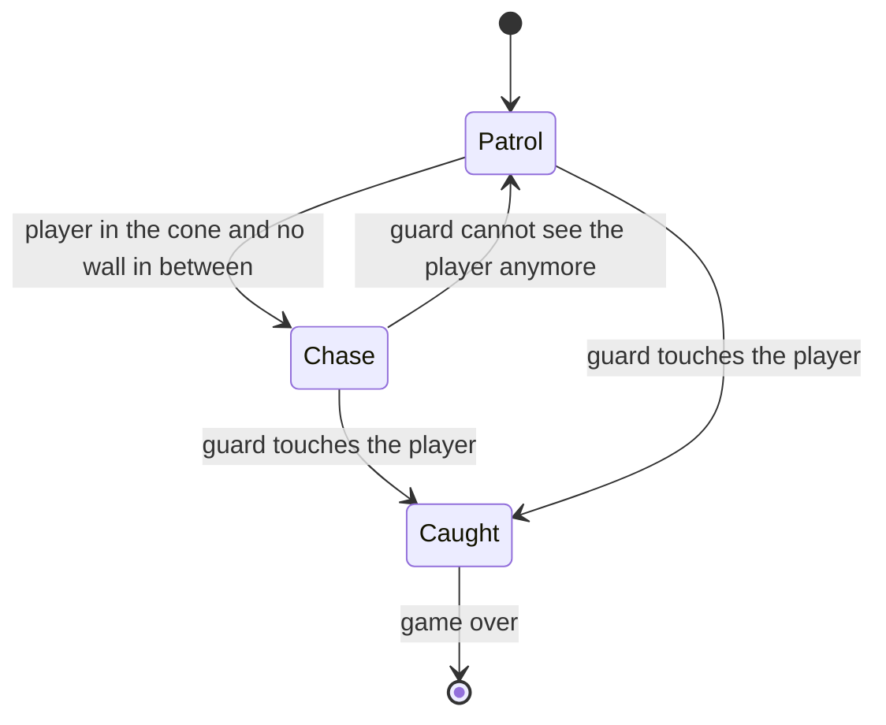
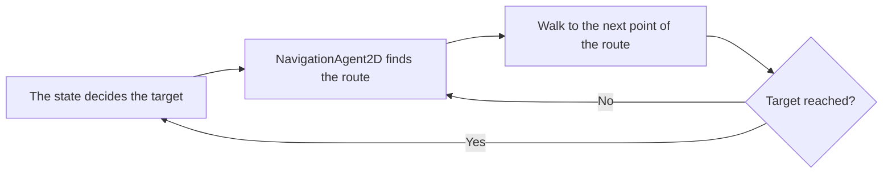
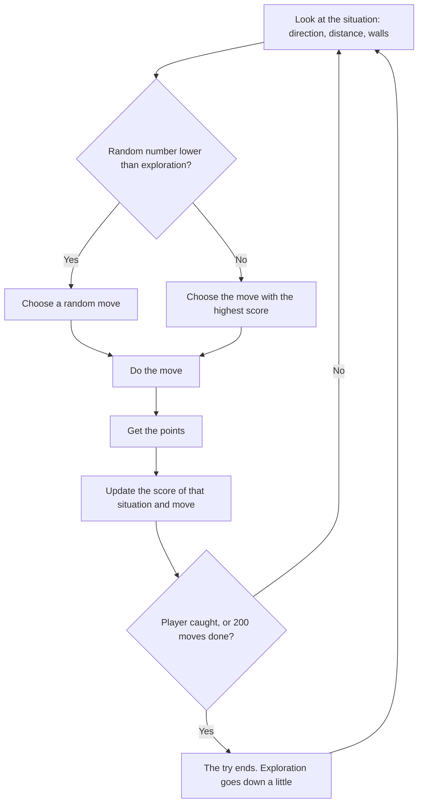

# Design: The Witness

**Client:** Nightfall Interactive
**Made by:** David Eslava, Fontys ICT student
**Version 0.2, 24 September 2026**

---

## 1. Introduction

In this document I explain how I build The Witness. It is based on the requirements in the [[The Witness - Analysis  0.2|Analysis]] and on the decisions in the [[Advice - engine and AI choice|Advice]] document. Short version of those decisions: the game is made in Godot 4 with GDScript, the guards use Godot's pathfinding plus a few simple rules, and The Hunter uses Q-learning with a table.

The document has two parts. Sections 2 to 5 are about what I build in the prototype: the tools, the level, the nodes and the guards. Section 6 is about something I design but do not build yet. That is The Hunter, together with how to measure if he gets better. Why I do not build him in this delivery is explained in the Analysis.

## 2. Technical choices

### 2.1 Tools

| Tool | What I use it for | Why (more in the Advice document) |
|---|---|---|
| Godot 4 | Game engine | Free, and the 2D tools are included |
| GDScript | All the code of the game | It looks like Python and comes with Godot |
| Blender | Making and animating the player in 3D, and rendering the sprites | From one 3D model I can make sprites in eight directions, so I don't have to draw every frame |
| draw.io | Main flowchart | Free and easy to change |
| Obsidian with Git | Documents and version history | Everything is in one vault, with a backup on GitHub |

### 2.2 Art style

The game has a noir comic style, inspired by Frank Miller. It only uses black, white and red. Red means danger. So the guards and their vision cones are the only red things on the screen, and the player can see quickly where the danger is.

I make the player sprites in Blender. First I made the character in 3D and animated it: idle, walking, running, crouching and sneaking. Then I rendered every animation from eight directions as images of 1024 × 1024. This way I don't need to draw frame by frame. I don't have the skills or the time for that.

In the prototype everything except the player is a placeholder. The walls are black rectangles and the guards are red squares, like my coach told me to do. The final art comes after the gameplay works.

### 2.3 Size of the world

The player sprites are 1024 × 1024, so in the game the player is around 400 units wide. The camera has a zoom of 0.3, which makes the player look the right size on screen. I made everything else in the level with the size of the player in mind. That way the placeholders still fit when I put in the real sprites.

| What | Size or speed |
|---|---|
| Player (collision circle) | radius 212, walks at 200, crouches at 100, runs at 1000 |
| Guard (red square) | 360 × 360, patrols at 150, chases at 300 |
| Vision cone of the guard | 90 degrees wide, 1800 units long (around four times the player) |
| Catch area of the guard | circle, radius 200 |
| Space the guard keeps from walls (pathfinding) | 200 |
| Walls | 100 units thick |
| Corridors and doors | at least 800 units wide (2 grid squares) |
| One square of the grid (level and The Hunter) | 400 × 400, around the size of the player |

The guard chases faster than the player walks, but slower than the player runs. So the player can always escape. They just have to decide to run.

## 3. Game flow

### 3.1 Main flowchart

The main flowchart shows the whole game in a simple way, from the title screen until you win or get a game over. I only made detailed diagrams for the two parts that are really complex, the guards (section 5) and The Hunter (section 6).

![[Flowchart - The Witness.drawio.svg]]

%% TO DO David: remove the "Continue / Load Game" branch from the flowchart. Saving is out of scope in the Analysis (3.2), so the flowchart should not show it. %%

The prototype has the main part of this flow. You play, a guard sees you, and you get a game over with the option to try again. The title screen, the comic introduction, the alert levels and The Hunter belong to the full game, not to this delivery.

### 3.2 Level layout

The level is one floor of the jazz club, and it has two parts. The first part is the jazz hall, a big open room with a bar, a stage and tables. The player starts there, in the bottom left corner. Behind a "Staff only" door is the second part, the staff area. It has a service corridor, a kitchen, a storage room, the office where the player saw the crime, and a construction zone that is not finished yet. The exit is at the end of the staff area.

![[Level layout sketch.svg]]

The two parts feel different on purpose. The jazz hall is open, so you can see a guard from far away and make a plan. The staff area is small and tight, with short corridors and a lot of corners, a bit like the game *Ape Out*. Around a corner you cannot see what is coming. But the guard cannot see you either, and that makes the second part more tense.

There are things to hide behind everywhere: tables, the bar, shelves, scaffolding, boxes. I need them. Without cover I cannot even test the vision cone, because the player has no way to break the line of sight (M-04).

I also wanted more than one way through. You can enter the staff area by the "Staff only" door or by a door from the bar into the kitchen. In the construction zone some walls are not finished, so the player can walk through the gaps. Because of this the player can choose a route and does not have to wait in one place.

For the guards, Guard 1 walks a loop around the tables in the jazz hall. Guard 2 walks up and down the service corridor, so the player has to use the side rooms and wait for the right moment. Guard 3 stands near the office and the exit, but only if I have time.

All corridors and doors are at least 2 grid squares (800 units) wide. This is not random. The guard is 360 units wide and pathfinding keeps 200 units away from walls, so a narrower door would be closed for the guards (M-07).

The whole level is 24 × 14 grid squares (9600 × 5600 units). That is bigger than the screen, so the camera has to follow the player.

## 4. Architecture

### 4.1 Scene tree

In Godot a game is made of nodes in a tree. The level is one scene. The guard is its own scene, so I can put more than one guard in the level. In the picture, red is the guard.

![[Scene tree.svg]]

A few things in the tree are like this on purpose. The walls and the furniture are inside the `NavigationRegion2D`, because Godot only cuts out the obstacles that are inside the region. If they are outside, the guard does not know they exist.

The camera is a child of the player. The level is bigger than the screen, so the camera has to follow the player around.

`PatrolRoute` is not a child of the enemy. A child always moves together with its parent. If the waypoints were children of the guard, they would move with it and the guard would never reach them.

### 4.2 How the scripts work together

| Script | On which node | What it does |
|---|---|---|
| `player_character.gd` | Player | Movement, crouching, running, and the right animation for each direction |
| `enemy.gd` | Enemy | Decides where the guard wants to go and moves it there with pathfinding (section 5) |
| `game_manager.gd` | Autoload, you can use it from everywhere as `GameManager` | Knows if the game is over, pauses the game, restarts the level |
| `game_over_screen.gd` | GameOverScreen | Appears when the player is caught, restarts when you press Enter |

The guard does not talk directly to the game over screen. When it catches the player, it calls `GameManager.catch_player()`. The game manager pauses the game and sends a signal called `player_caught`. The game over screen listens to that signal and appears. I did it like this so every part works on its own. A second guard, or The Hunter later, only has to call the same function.

### 4.3 Collision layers

In Godot, collision layers decide what can touch what. Every object is *on* a layer, and it *looks at* other layers (this is called the mask).

| Object | On layer | Looks at |
|---|---|---|
| Walls and furniture | world | nothing |
| Player | player | world |
| Body of the guard | enemy | world |
| Vision cone of the guard | nothing | player |
| Catch area of the guard | nothing | player |
| Sight line of the guard | nothing | world and player |

The sight line is the only one that looks at both. It has to hit the walls to know that a wall is in the way. And it has to hit the player to know that nothing is in the way.

### 4.4 How I write the code

When something has different options, like the state of the guard, I use an `enum` with a `match` instead of a lot of `if`. This was feedback from my coach. Speeds, distances and turn speed are `@export` variables, so I can change them in the editor while I test, without touching the code. Every script also starts with a short comment that explains what it is for.

## 5. The guards

A guard does two different things. It decides where to go, the next patrol point or the player, and for that I use a few simple rules (5.1). Then it has to actually get there, around the bar, the stage and the tables. For that I use pathfinding (5.2).

### 5.1 Deciding where to go

A guard is always in one of three states, and every state gives the guard a target.

| State | Target | Speed |
|---|---|---|
| **Patrol** | The next waypoint. When it gets there, the next one. After the last one it starts again with the first | 150 |
| **Chase** | Where the player is now, updated every frame | 300 |
| **Caught** | No target. The guard stops and the game manager does the rest | 0 |

The guard always turns to the direction it walks, and the vision cone turns with it.

If I have time, the first thing I add is a **Search** state (Should Have S-03). When the guard loses the player, it goes to the last place where it saw them and looks around for a few seconds. After that it goes back to its patrol. The pathfinding is already there, so this is only a new target. No new movement code.

### 5.2 Getting there: pathfinding

The guards use Godot's navigation, like I recommend in the Advice document. It works in two steps.

First, the floor. A `NavigationRegion2D` covers the level. I draw the outline of the whole floor and press *Bake*. Godot then cuts out the walls and the furniture and leaves 200 units of space around them, which is about the size of the guard. The result is a map of every place where a guard can stand.

Second, the route. Every guard has a `NavigationAgent2D`. The script gives it a target (from the table in 5.1), and the agent gives back the next point of the shortest way around the obstacles. The guard walks to that point. When it gets there, it asks for the next one.

Because of this I can put the waypoints anywhere on the floor. And a guard that chases the player walks around a table, not into it (M-07).

### 5.3 How the guard sees the player

One check is not enough for the guard to see the player. It needs two.

The first check is if the player is inside the cone. The `Vision` area tells the script when the player goes in or out of the cone, so this covers the distance and the angle. The problem is that an area in Godot does not know about walls. With only this check, the guard could see through the bar.

That is why there is a second check: is there something in the way? When the player is inside the cone, the `SightLine` raycast points at the player every frame. If the first thing it hits is the player, the guard sees them. If it hits a wall or furniture first, it doesn't.

The guard only starts to chase when both checks are true. This is what makes hiding behind things work (M-06).

## 6. The Hunter (designed, not built in this delivery)

The Hunter is the right-hand man of the boss, and he is the enemy the client wants to test. He is different from the guards because he has no route. He decides every move himself, and after many tries he gets better. In this section I describe him with enough detail to build him in the next iteration.

### 6.1 How Q-learning works

The Hunter has a table. Every row is a situation and every column is a move. In every cell there is a number that says how good that move was in that situation until now.

At the start all the numbers are zero, so he moves more or less at random. After every move he gets or loses points, and he changes the number of the move he just did. After many tries, the moves that bring him closer to the player have higher numbers, and he chooses them more often.

### 6.2 What The Hunter knows (the state)

The Hunter does not see the whole map. He moves on the grid from section 2.3 and he only knows this:

| What he knows | Options | How many |
|---|---|---|
| Direction to the player | N, NE, E, SE, S, SW, W, NW | 8 |
| Distance to the player | close (1 to 2 squares), medium (3 to 5), far (6 or more) | 3 |
| Is there a wall up, down, left, right, next to him? | yes or no, for each one | 16 |

So there are 8 × 3 × 16 = **384 situations**.

In my first version The Hunter only knew the direction and the distance. Then I saw a problem. In 6.4 he loses points when he walks into a wall, but he cannot learn to avoid a wall if he does not know it is there. Without the walls in the state, the same situation sometimes has a wall and sometimes not, and the table never gets stable. So I added them.

### 6.3 What The Hunter can do (the actions)

He has four moves, one square each time: **up, down, left, right**.

With 384 situations and 4 moves, the table has 1,536 numbers. That is small. He can learn fast, and I can open the table and read it when something looks wrong.

### 6.4 Points (rewards)

| What happened after the move             | Points                |
| ---------------------------------------- | --------------------- |
| He caught the player                     | +50, and the try ends |
| He got closer to the player              | +1                    |
| He stayed at the same distance           | −0.1                  |
| He got further from the player           | −1                    |
| He walked into a wall (and did not move) | −5                    |

The small minus for staying at the same distance is there so he does not learn to walk sideways forever. Catching the player gives a lot more points than anything else, so catching is always better than many small steps.
### 6.5 How he learns

After every move, the number in the table for that situation and that move changes like this:

*new value = old value + learning rate × (points + discount × best value in the new situation − old value)*

In simple words, the score of the move goes a little bit in the direction of "the points I just got, plus how good my new situation is". These are the values I would start with:

| Setting | Value | What it means |
|---|---|---|
| Learning rate | 0.1 | Every new try only changes the score by 10%, so one lucky move does not change the whole table |
| Discount | 0.9 | Catching the player in a few moves still counts, so he learns to think a little bit ahead |
| Exploration | starts at 1.0, goes down to 0.05 during training | At the start he tries random moves to find what works. Later he mostly uses what he learned, but sometimes he still tries something new |

A try ends when The Hunter catches the player, or after 200 moves. Otherwise a Hunter that never finds the player would go on forever.

### 6.6 Training

Training against a real person would need hundreds of tries, and nobody wants to play that long. So first The Hunter trains against a simple fake player in a copy of the level. The fake player runs away from him on random routes, and Godot can run this much faster than normal time. After the training the table is saved in a file. Then I load the trained Hunter in the real game, where he keeps learning from the real player.

### 6.7 How to measure if he gets better

This is the answer to the question of the client. That's why I define it before I build anything.

In every try I save how many moves The Hunter needed to catch the player (200 if he did not catch them), if he caught the player within 200 moves or not, and how many times he walked into a wall.

Then I do the comparison. I start with 50 tries with a Hunter **without training**, where the whole table is zero and he moves at random. These start from 10 fixed positions. After that I train him for 500 tries against the fake player. Then I do the same 50 tries again with the **trained** Hunter, with exploration turned off, so he only uses what he learned. At the end I compare the averages and make a graph of the moves he needed during the 500 training tries. This graph is the learning curve.

He is better when the trained Hunter needs clearly fewer moves than the untrained one, catches the player more often within 200 moves, and the learning curve goes down instead of staying flat. If this does not happen, I write down the result as it is, like I promise in the Analysis.

The numbers are not everything, though. The client also wants to know if players can *see* that he gets better. So after five tries against The Hunter, I ask the testers one question: "Did The Hunter get better at finding you?" If he improves in the numbers but players don't notice it, it is not useful for the client.
### 6.8 Limits of this design

The Hunter only knows the direction of the player and the walls next to him. He does not know the whole level. So he can learn "go around the wall on the left when the player is north-east", but he cannot learn a route through different rooms. He also trains against only one type of fake player. If real players play very differently, he needs time to adapt.

For a first enemy that learns, I think this is OK. These two limits are also the first things I would improve in a next version.

## 7. Requirements and where they are in this design

| Requirement | Where in this document |
|---|---|
| M-01 Play the game | 3.1 Main flowchart, 4.1 Scene tree |
| M-02 Move in eight directions | 4.2 `player_character.gd` |
| M-03 Cannot walk through walls | 4.3 Collision layers |
| M-04 Use cover | 3.2 Level layout |
| M-05 Enemies that move | 5.1 Deciding where to go |
| M-06 Only seen inside the cone | 5.3 How the guard sees the player |
| M-07 Enemies walk around walls | 5.2 Pathfinding |
| M-08 Told when caught | 4.2 Game manager and game over screen |
| C-01 Enemy that gets better | 6 The Hunter |

In the [[Validation]] document I test every Must Have with this design.
