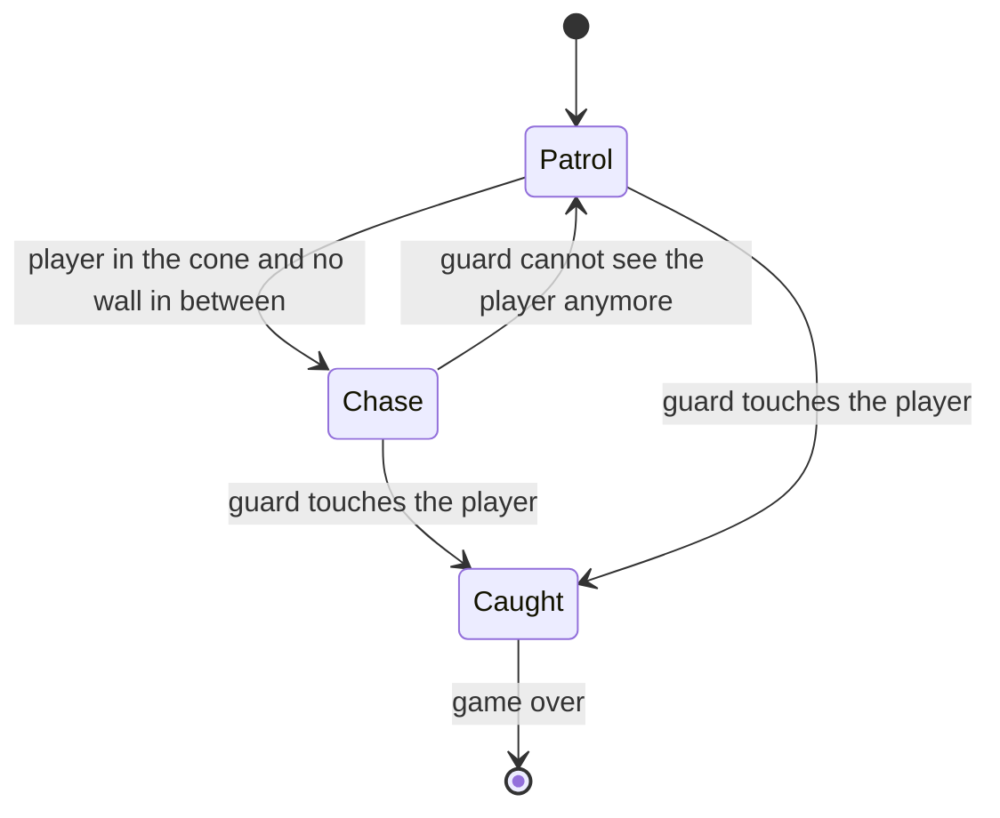
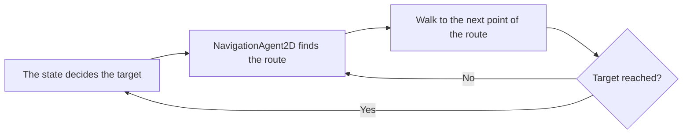
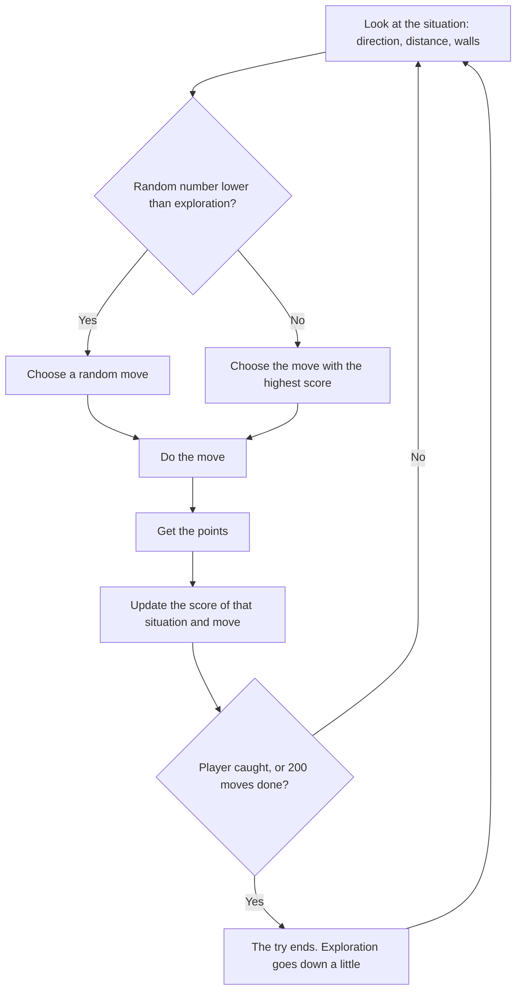

# Design: The Witness

**Client:** Nightfall Interactive  
**Made by:** David Eslava, Fontys ICT student  
**Version 0.1, 25 September 2026**

---

## 1. Introduction

In this document, I explain how I build The Witness. It is based on the requirements in the [[The Witness - Analysis  0.2|Analysis]] and the decisions in the [[Advice - engine and AI choice|Advice]] document. In short: the game uses Godot 4 with GDScript, guards use Godot’s pathfinding with some simple rules, and The Hunter uses Q-learning with a table.

This document has two parts. Sections 2 to 5 cover what I build in the prototype: the tools, the level, the nodes, and the guards. Section 6 is about The Hunter, which I designed but have not built yet. I also explain how to measure if he improves. The reason I did not build him for this delivery is explained in the Analysis.

## 2. Technical choices

### 2.1 Tools

| Tool | What I use it for | Why (more in the Advice document) |
| --- | --- | --- |
| Godot 4 | Game engine | Free, and the 2D tools are included |
| GDScript | All the code of the game | It looks like Python and comes with Godot |
| Mixamo | A 3D character (a mannequin) and its animations | Free, and the animations are already made |
| Blender | Changing the style of the character and rendering the sprites from above | From one 3D model I can make sprites in eight directions, so I don’t have to draw every frame |
| draw.io | Main flowchart | Free and easy to change |
| Obsidian with Git | Documents and version history | Everything is in one vault, with a backup on GitHub |

### 2.2 Art style

The game has a noir comic style, inspired by Frank Miller. It only uses black, white and red. Red means danger, so only the guards and their vision cones are red. This helps the player to see quickly where the danger is.

Finding real top-down sprites was a big problem at the start. AI was not useful for the type of sprites I needed. So I tried something different. I downloaded a mannequin from Mixamo with its animations: idle, walking, running, crouch walking, crouch idle and walking on tiptoes. In Blender I changed the style with nodes and put the camera directly above the character, so it is a real top-down view like in *Ape Out*. Then I rendered the animations from eight directions as images of 1024 × 1024. A Mixamo animation has a lot of frames, so I only kept around one of every four. This way I don’t need to draw frame by frame. I don’t have the skills or the time for that.

Right now, the sneaking (tiptoe) animation only has four directions, and the game does not use it yet.

In the prototype, everything except the player is a placeholder. The walls are black rectangles and the guards are red squares, as my coach suggested. I will add the final art after the gameplay is working.

### 2.3 Size of the world

The player sprites are 1024 × 1024, which is too large for the game. In the player scene, I scale the sprite down to 0.063, making the player about 64 units wide. The camera is attached to the player and currently has a zoom of 5. I designed everything else in the level based on the player's size: one grid square is 64 units, about the size of the player. This way, the placeholders will still fit when I add the real sprites.

| What | Size or speed |
|---|---|
| Player | sprite around 64 wide, collision circle radius 13, walks at 200, crouches at 100, runs at 1000 |
| Guard (red square) | 56 × 56, patrols at 150, chases at 300 |
| Vision cone of the guard | 90 degrees wide, 288 units long (four and a half squares) |
| Catch area of the guard | circle, radius 32 |
| Space the guard keeps from walls (pathfinding) | 32 |
| Walls | 100 units thick |
| Corridors and doors | at least 128 units wide (2 grid squares) |
| One square of the grid (level and The Hunter) | 64 × 64, around the size of the player |

The guard chases faster than the player walks, but slower than the player runs. Right now, running has no limit, so the player can always escape. The stamina bar from S-01 will fix this, making running a choice that comes with a cost.

## 3. Game flow

### 3.1 Main flowchart

The main flowchart gives a simple overview of the whole game, from the title screen to winning or getting a game over. I made detailed diagrams only for the two most complex parts: the guards (section 5) and The Hunter (section 6).  
![[Flowchart - The Witness.drawio 0.2.svg]]

The prototype includes the main part of this flow. You play, a guard sees you, and you get a game over with the option to try again. The title screen, comic introduction, alert levels, and The Hunter are part of the full game, not this delivery.

### 3.2 Level layout

The level is set on one floor of the jazz club. I first drew it by hand, then changed it to make the game feel more tense.

![[Level map - maze version.png]]

The level has two very different areas. The first is the jazz hall, a large open room with the bar, stage, and tables. The player starts here. Since it is open, you can see the guard from far away and plan your moves.

Behind the double door, the space becomes much tighter. My first drawing had big rooms, but that felt boring for a stealth game. I prefer narrow spaces, like in *Ape Out* or the stealth parts of *Resident Evil*, where you never know what is around the corner. So, behind the jazz hall, I created a small maze. A real jazz club might not look like this, but since it is a game, I can design it how I want.

The office, where the player witnessed the crime, is in the center of the maze. A U-shaped service corridor wraps around it. Along the corridor are a kitchen, staff toilet, small closet, storage room, and an unfinished construction area.

The exit is not at the front. The main entrance is in the lobby, but a gangster guards the door. The real way out is a back door to the alley, located at the top of the construction zone. This means the player must go through the entire maze to escape.

I wanted to offer more than one path. You can follow the service corridor, or go through the kitchen, pass a broken wall into the construction zone, and come out in the middle of the corridor. The storage room has two doors, so it can be used as a shortcut. This way, the player can choose their route and does not have to wait in one spot.

There are many objects to hide behind, like tables, the bar, shelves, scaffolding, and boxes. These are necessary; without cover, I cannot test the vision cone because the player would have no way to break the line of sight (M-04). There are also three hiding spots: the staff toilet, the closet at the end of a dead end, and a gap between shelves in the storage room. Hiding is a Could Have (C-02), so in the prototype, these are just good places to wait.

The red dashed lines on the map show the guards' routes:

| Guard | Where | What it does | In the prototype? |
| --- | --- | --- | --- |
| G1 | Jazz hall | Walks a loop around the tables | Yes, this is the first one I build |
| G2 | Service corridor | Walks the U around the office, and back | Next. It is the same guard scene with another route |
| G3 | Construction zone | Walks around the zone, right before the exit | Only if I have time |
| G4 | Lobby | Stands still and watches the main entrance | Only if I have time |

G4 is a different kind of guard because he does not walk. In the code, this is simple: he is a normal guard with a patrol route that has only one point.

All corridors and doors are at least 2 grid squares (128 units) wide. This is on purpose. The guard is 56 units wide, and pathfinding keeps 32 units away from walls, so a narrower door would block the guards (M-07).

The entire level is about 24 × 14 grid squares (1536 × 896 units). This is larger than the screen, so the camera needs to follow the player.

### 3.3 Screens (wireframes)

Before building the screens, I draw them as wireframes. A wireframe is a simple drawing that shows what is on a screen and where, without any final art. This helps me check if a screen makes sense before spending time on it in Godot.

| Screen | What is on it | Requirement |
| --- | --- | --- |
| Main menu | The title, New Game, Controls and Quit. In the background, the entrance of the jazz club at night | S-04 |
| Gameplay HUD | Almost nothing. A small stamina bar that only shows when you run, and a meter above a guard when he starts to see you | S-01, S-02 |
| Caught | The word CAUGHT in red, Try again (Enter) and Main menu | M-08, S-04 |
| Escaped | The word ESCAPED, the time you needed, Play again and Main menu | M-09 |
| Controls | WASD to move, Shift to run, Ctrl to crouch, Enter to choose, Esc for the menu | M-02 |

I intentionally keep the HUD very small. This is a noir game focused on tension. If the screen is crowded with bars and icons, players will look at those instead of the guards. There is also no minimap, because that would make the maze less scary.

For this delivery, only the Caught screen needs to work, since it is a Must Have (M-08). The other screens are designed now and will be built later.

I drew the main menu wireframe myself. The other four screens were made in the same sketch style as the level map, with help from AI, based on my descriptions. I did this to meet the deadline.

![[Main Menu Wireframe.jpg]]

![[Wireframe 2 - Gameplay HUD.png]]

![[Wireframe 3 - Caught.png]]

![[Wireframe 4 - Escaped.png]]

![[Wireframe 5 - Controls.png]]

## 4. Architecture

### 4.1 Scene tree

In Godot, a game is made up of nodes arranged in a tree. The level is one scene, and the guard is its own scene, so I can add more than one guard to the level. In the diagram, red represents the guard.

![[Scene tree.svg]]

Some things in the tree are set up this way on purpose. The walls and furniture are inside the `NavigationRegion2D` because Godot only recognizes obstacles that are inside the region. If they are outside, the guard does not know they exist.

The camera is attached to the player. Since the level is bigger than the screen, the camera needs to follow the player around.

`PatrolRoute` is not a child of the enemy. If it were, the waypoints would move with the guard, and the guard would never reach them.

### 4.2 How the scripts work together

| Script | On which node | What it does | Status |
| --- | --- | --- | --- |
| `player_character.gd` | Player | Movement, crouching, running, and the right animation for each direction | Done |
| `enemy.gd` | Enemy | Decides where the guard wants to go and moves it there with pathfinding (section 5) | To build |
| `game_manager.gd` | Autoload, you can use it from everywhere as `GameManager` | Knows if the game is over, pauses the game, restarts the level | To build |
| `game_over_screen.gd` | GameOverScreen | Appears when the player is caught, restarts when you press Enter | To build |

The guard does not interact directly with the game over screen. When it catches the player, it calls `GameManager.catch_player()`. The game manager pauses the game and sends a signal called `player_caught`. The game over screen listens for that signal and then appears. I set it up this way so each part works independently. A second guard or The Hunter can just call the same function.

### 4.3 Collision layers

In Godot, collision layers decide what can touch what. Every object is *on* a layer, and it *looks at* other layers (this is called the mask).

| Object | On layer | Looks at |
| --- | --- | --- |
| Walls and furniture | world | nothing |
| Player | player | world |
| Body of the guard | enemy | world |
| Vision cone of the guard | nothing | player |
| Catch area of the guard | nothing | player |
| Sight line of the guard | nothing | world and player |

The sight line is the only one that checks both. It needs to detect walls to know if something is blocking the view, and it needs to detect the player to confirm there is a clear line of sight.

### 4.4 How I write the code

When the code needs to choose between many options, I use `match`, which is the GDScript version of switch/case. Faruk suggested this on 18 September.

You can see why in my player script. My first version used a long list of `if` and `elif` statements for every direction, and inside each one another `if` for walking or running. It was around 50 lines and did not work well. On 21 September I changed it. Now `Vector2i(input.sign())` turns the keys into a direction like `(1, -1)`, and a single `match` turns that direction into the animation name, like `Up_Right`. Then I just add the state in front: `Walking_Up_Right`, `Running_Up_Right` or `Crouch_Up_Right`. This way, one short `match` replaces a whole page of code. I still use a short `if` and `elif` to choose the state (Walking, Running or Crouch), depending on which key the player holds down.

I plan to use the same idea for the guard. It gets its three states from 5.1 as an `enum` (a list of names), and a `match` statement decides what the guard does in each state.

The player's speed, acceleration, and friction are `@export` variables, so I can change them in the editor while testing, without editing the code. `base_speed` is set to 60 in the script, but in the player scene, I set it to 200, which is the value the game uses.

## 5. The guards

A guard does two main things. First, it decides where to go next, a patrol point or the player. For this it uses a few simple rules (5.1). Then, it needs to actually get there, moving around the bar, stage, and tables. For this, I use pathfinding (5.2).

### 5.1 Deciding where to go

A guard is always in one of three states, and each state gives the guard a target.

| State | Target | Speed |
|---|---|---|
| **Patrol** | The next waypoint. When it gets there, the next one. After the last one it starts again with the first | 150 |
| **Chase** | Where the player is now, updated every frame | 300 |
| **Caught** | No target. The guard stops and the game manager does the rest | 0 |

The guard always turns to the direction it is walking, and the vision cone turns with it.

If I have time, the first thing I will add is a **Search** state (Should Have S-03). When the guard loses the player, it will go to the last place it saw them and look around for a few seconds. After that, it returns to its patrol. The pathfinding is already set up, so this just means giving it a new target. No new movement code is needed.

### 5.2 Getting there: pathfinding

The guards use Godot’s navigation system, as I recommended in the Advice document. It works in two steps.

First, the floor: a `NavigationRegion2D` covers the level. I draw the outline of the whole floor and press *Bake*. Godot then removes the walls and furniture from the navigation area, leaving 32 units of space around them, which is a bit more than half the guard's width. The result is a map showing every place a guard can stand.

Second, the route: each guard has a `NavigationAgent2D`. The script gives it a target (from the table in 5.1), and the agent returns the next point on the shortest path around obstacles. The guard walks to that point, and when it arrives, it asks for the next one.

Because of this I can put the waypoints anywhere on the floor. And a guard that chases the player walks around a table, not into it (M-07).

### 5.3 How the guard sees the player

One check is not enough for the guard to see the player. It needs two checks.

The first check is whether the player is inside the vision cone. The `Vision` area tells the script when the player enters or leaves the cone, covering both distance and angle. The problem is that an area in Godot does not detect walls. With only this check, the guard could see through the bar.

That is why there is a second check: is something in the way? When the player is inside the cone, the `SightLine` raycast points at the player every frame. If the first thing it hits is the player, the guard sees them. If it hits a wall or furniture first, the guard does not see the player.

The guard only starts to chase when both checks are true. This is what makes hiding behind things work (M-06).

## 6. The Hunter (designed, not built in this delivery)

The Hunter is the boss’s right-hand man and the enemy the client wants to test. He is different from the guards because he does not follow a set route. He decides every move himself and gets better after many tries. In this section, I describe him in enough detail to build him in the next iteration.

### 6.1 How Q-learning works

The Hunter uses a table where each row is a situation and each column is a move. Every cell contains a number showing how good that move has been in that situation so far.

At first, all the numbers are zero, so The Hunter moves more or less at random. After each move, he gains or loses points and updates the number for the move he just made. After many tries, the moves that bring him closer to the player have higher numbers, so he chooses them more often.

### 6.2 What The Hunter knows (the state)

The Hunter does not see the whole map. He moves on the grid from section 2.3 and he only knows this:

| What he knows | Options | How many |
| --- | --- | --- |
| Direction to the player | N, NE, E, SE, S, SW, W, NW | 8 |
| Distance to the player | close (1 to 2 squares), medium (3 to 5), far (6 or more) | 3 |
| Is there a wall up, down, left, right, next to him? | yes or no, for each one | 16 |

So there are 8 × 3 × 16 = **384 situations**.

In my first version, The Hunter only knew the direction and distance. Then I noticed a problem. In 6.4, he loses points when he walks into a wall, but he cannot learn to avoid a wall if he does not know it is there. Without including walls in the state, the same situation sometimes has a wall and sometimes does not, so the table never becomes stable. That is why I added walls to the state.

### 6.3 What The Hunter can do (the actions)

The Hunter can only move one square at a time: **up, down, left or right**. No diagonals. I kept it this way on purpose, because each extra move would make the table larger. With eight moves, it would be twice as big.

So how big is the table? 384 situations × 4 moves = 1,536 numbers. For a computer, this is very small, so The Hunter can learn quickly. It also means I can open the table and check it myself. If The Hunter keeps walking into the same wall, I can find that row and see which number is off.

### 6.4 Points (rewards)

| What happened after the move | Points |
| --- | --- |
| He caught the player | +50, and the try ends |
| He got closer to the player | +1 |
| He stayed at the same distance | −0.1 |
| He got further from the player | −1 |
| He walked into a wall (and did not move) | −5 |

The small minus for staying at the same distance is there so he does not learn to walk sideways forever. Catching the player gives a lot more points than anything else, so catching is always better than many small steps.

### 6.5 How he learns

This was the part I found hardest to understand, so I will explain it in the way that finally made sense to me.

The Hunter learns with the Q-learning update rule. I did not invent this formula. I learned it from the sentdex videos and the Medium guide in my sources:

*new value = old value + learning rate × (points + discount × best value in the new situation − old value)*

The first time I saw it, it looked very complicated. So I tried it with an example from my own game. The Hunter is far from the player, the player is north-east, and there are no walls around him. The score for “up” is still 0, because he never tried it. He goes up and gets 1 point, because now he is closer. From his new square, the best move has a score of 2. So the new score for “up” is 0 + 0.1 × (1 + 0.9 × 2 − 0) = 0.28.

That is a small step. But if “up” keeps working in that situation, the score keeps increasing. After many tries, The Hunter almost always chooses it.

Here are the values I would start with:

| Setting | Value | What it means |
| --- | --- | --- |
| Learning rate | 0.1 | Every new try only changes the score by 10%, so one lucky move does not change the whole table |
| Discount | 0.9 | Catching the player in a few moves still counts, so he learns to think a little bit ahead |
| Exploration | starts at 1.0, goes down to 0.05 during training | At the start he tries random moves to find what works. Later he mostly uses what he learned, but sometimes he still tries something new |

A try ends when The Hunter catches the player or after 200 moves. Otherwise, a Hunter that never finds the player would keep going forever.

### 6.6 Training

Training against a real person would take hundreds of tries, and nobody wants to play that long. So first, The Hunter trains against a simple fake player in a copy of the level. The fake player runs away from him on random routes, and Godot can run this much faster than real time. After training, the table is saved in a file. Then I load the trained Hunter into the real game, where he continues learning from the real player.

### 6.7 How to measure if he gets better

This answers the client’s question, which is why I define it before building anything.

In every try, I record how many moves The Hunter needed to catch the player (200 if he did not catch them), whether he caught the player within 200 moves, and how many times he walked into a wall.

Then I do the comparison. I start with 50 tries with a Hunter **without training**, where the whole table is zero and he moves at random. These start from 10 fixed positions. After that I train him for 500 tries against the fake player. Then I do the same 50 tries again with the **trained** Hunter, with exploration turned off, so he only uses what he learned. At the end I compare the averages and make a graph of the moves he needed during the 500 training tries. This graph is the learning curve.

He is better when the trained Hunter needs clearly fewer moves than the untrained one, catches the player more often within 200 moves, and the learning curve goes down instead of staying flat. If this does not happen, I write down the result as it is, like I promise in the Analysis.

The numbers are not everything, though. The client also wants to know if players can *see* that he gets better. So after five tries against The Hunter, I ask the testers one question: “Did The Hunter get better at finding you?” If he improves in the numbers but players don’t notice it, it is not useful for the client.

### 6.8 Limits of this design

The Hunter only knows the direction of the player and the walls next to him. He does not know the whole level. So he can learn “go around the wall on the left when the player is north-east”, but he cannot learn a route through different rooms. He also trains against only one type of fake player. If real players play very differently, he needs time to adapt.

For a first enemy that learns, I think this is OK. These two limits are also the first things I would improve in a next version.

## 7. Requirements and where they are in this design

| Requirement | Where in this document |
| --- | --- |
| M-01 Play the game | 3.1 Main flowchart, 4.1 Scene tree |
| M-02 Move in eight directions | 4.2 `player_character.gd` |
| M-03 Cannot walk through walls | 4.3 Collision layers |
| M-04 Use cover | 3.2 Level layout |
| M-05 Enemies that move | 5.1 Deciding where to go |
| M-06 Only seen inside the cone | 5.3 How the guard sees the player |
| M-07 Enemies walk around walls | 5.2 Pathfinding |
| M-08 Told when caught | 4.2 Game manager and game over screen |
| M-09 Escape through the exit | 3.2 Level layout, 3.3 Escaped screen |
| S-01 Stamina, S-02 Detection meter | 3.3 Gameplay HUD |
| S-04 Menu and try again | 3.3 Main menu and Caught screen |
| C-02 Hiding spots | 3.2 Level layout |
| C-01 Enemy that gets better | 6 The Hunter |

In the [[Validation]] document I test every Must Have with this design.