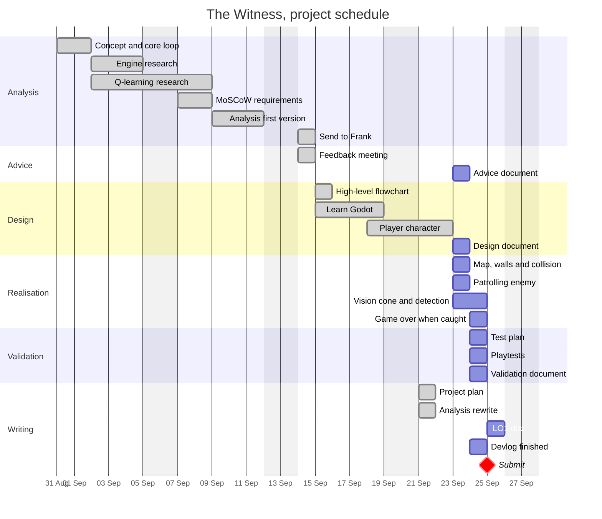

# Project Plan: The Witness

**Client:** Nightfall Interactive
**Made by:** David Eslava, ICT student
**Coaches:** Frank and Faruk
**Project period:** 1 September to 25 September 2026 (4 weeks)
**Deadline:** Friday 25 September 2026 at 16:00

---

## 1. What this plan is for

The Analysis says what I build and why. This plan says when I do it, in what order, and how many hours each part takes. Frank asked me for a separate plan with a Gantt chart, with the activities, the hours and the dependencies in it.

## 2. What gets delivered

I deliver two things. The first is a playable prototype. In it the player moves in a map with walls, and one enemy walks a route. The enemy can see the player with a vision cone, and when the player is caught the game is over.

The second is the documentation: Analysis, Advice, Design, this plan, Validation, an orientation report and the devlog. Everything in the Will Not Have list of the Analysis is out of scope.

The adaptive Hunter is a Could Have, and I do not build it in this delivery. My coach agreed with this on 22 September. Instead I deliver a full design of The Hunter, with an explanation of how I would measure if he improves. This is in the Design document. The stealth part has to work first. Without it there is nothing to measure the learning enemy against.

## 3. Phases

| Phase | When | Finished when |
|---|---|---|
| Analysis | Week 1 to 2 | Analysis delivered to Frank |
| Advice | Week 3 to 4 | Engine and AI choices written down with the reasons |
| Design | Week 3 to 4 | Architecture and flowcharts are done |
| Realisation | Week 4 | Prototype does everything in Must Have |
| Validation | Week 4 | Tests are done and written down |
| Delivery | 25 September | Everything sent before 16:00 |

## 4. Activities

The hours are my estimates. The status is from Wednesday 23 September.

### Analysis

| Activity | Hours | Can't start until | Status |
|---|---|---|---|
| Decide the concept, the setting and the core loop | 4 | - | Done |
| Compare game engines (Godot, Unity, GameMaker, Pygame) | 6 | concept is decided | Done |
| Research Q-learning for chasing on a grid | 8 | concept is decided | Done |
| Write the MoSCoW table | 4 | concept is decided | Done |
| Write the Analysis, first version | 6 | research and MoSCoW done | Done |
| Export it and send it to Frank | 1 | Analysis written | Done |

### Advice

| Activity | Hours | Can't start until | Status |
|---|---|---|---|
| Feedback meeting with Frank, and write down what he said | 2 | Analysis sent | Done, 14 Sep |
| Write the Advice document with the engine and AI comparison and why I chose them | 3 | the research and the feedback | Wednesday |

### Design

| Activity | Hours | Can't start until | Status |
|---|---|---|---|
| Draw the high level flowchart | 3 | Analysis written | Done |
| Learn Godot with a tutorial project (nodes, scenes, tilemaps, collisions) | 12 | engine chosen | Done |
| Build the player with 8 direction movement and the animations | 10 | Godot basics | Done |
| Write the Design document with the technical choices, the scenes and a flowchart for the detection | 4 | Advice document | Wednesday |

### Realisation

| Activity | Hours | Can't start until | Status |
|---|---|---|---|
| Build the map with tilemap, walls and collision | 3 | Design written | Wednesday |
| One enemy that walks a fixed route | 2 | map exists | Wednesday |
| Vision cone and line of sight detection | 3 | enemy patrols | Wed to Thu |
| Game over and restart when the player is caught | 1.5 | detection works | Thursday |

### Validation

| Activity | Hours | Can't start until | Status |
|---|---|---|---|
| Write the test plan | 1 | prototype playable | Thursday |
| Test the game with two or three people | 1.5 | test plan | Thursday |
| Write the Validation document | 1.5 | tests are done | Thursday |

### Documentation and portfolio

| Activity | Hours | Can't start until | Status |
|---|---|---|---|
| Write this plan | 2 | feedback meeting | Done |
| Rewrite the Analysis for the client | 4 | feedback meeting | Done |
| Finish the devlog and put everything in English | 1 | - | Thursday |
| Write the evidence descriptions for every piece | 1.5 | the piece exists | As I go |
| Write the orientation report | 2 | - | Friday |
| Last check and send everything | 1 | everything else | Thursday |

**Total: 88 hours. 62 are done and 26 are left.**

## 5. Gantt chart

## 6. The rest of the week

| Day | What I do | Hours |
|---|---|---|
| **Mon 21** | Project plan, Analysis rewrite | 6, done |
| **Tue 22** | Finish the Analysis version 0.2, reorganise the portfolio by learning outcome | 8, done |
| **Wed 23** | Advice document (1.5), Design document (2.5), map and walls (2.5), patrolling enemy (1.5) | 8 |
| **Thu 24** | Vision cone (2.5), game over (1), test plan and tests (2), Validation (1.5), devlog in English (1), LO2 evidence descriptions (1) | 9 |
| **Fri 25** | Orientation doc (1.5), career choice and workshop log (1), core values and feedback log (1), last evidence descriptions (1), last check and send (0.5) | 5, finish at 13:00 |

I do the writing before the code on purpose. The documents don't need the game to work, so if the game is late, at least the documents are finished. Friday was supposed to be my extra time. Now I need it, because Tuesday went to the Analysis.

## 7. What can go wrong

The biggest problem right now is that I am one day late. On Tuesday I finished the Analysis and reorganised the portfolio, but I did not write the Advice and Design documents. So Friday morning is now work time, not extra time. I made a new plan on Wednesday morning instead of finding out on Thursday night.

The detection can also take more time than I think. I make the vision cone with an Area2D in the shape of a cone that turns with the enemy, plus one raycast so walls block the view. This is the simplest way that still gives me the Must Have. If it takes more than half a day, I only use the Area2D and I explain this in the Validation.

Then there is the size of my sprites. They are 1024 × 1024 and the camera zoom is 0.3, and a normal tileset is difficult with this size. So I build the map with simple rectangles at the same scale as the player. Frank said placeholders are fine.

And I know myself: I can forget the evidence descriptions. That's why I write each description right after I finish the piece, not all of them on Thursday night.

**If I am late, I cut in this order:** first the title screen and the game over screen, then the alert gauge, then the visual polish. I do not cut the Must Haves, and I do not cut the documents.

## 8. How I know I am finished

I am finished when the game works. That means you can walk in a map with walls, a patrolling enemy can see you, and you can be caught. The seven points Frank gave me on 14 September also have to be done.

On the documentation side, the Analysis, Advice, Design, this plan, the Validation, the orientation report and the devlog must be finished and in English. And every piece in my portfolio needs its evidence description: why it is there, what I learned, and what I would do differently next time.
