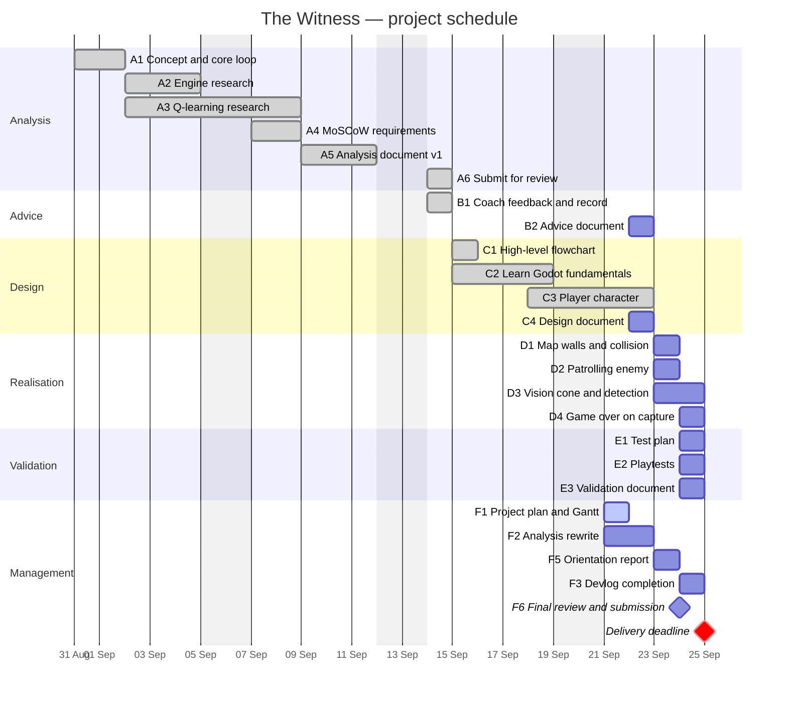

| | |
|---|---|
| **Project** | The Witness — a 2D top-down stealth prototype |
| **Client** | Nightfall Interactive (fictional client) |
| **Contractor** | David Eslava, student, Fontys University of Applied Sciences |
| **Programme** | ICT StartSemester — Challenge 1 (STA-OIL 4.70) |
| **Coach** | Frank |
| **Project period** | Monday 31 August 2026 – Friday 25 September 2026 (4 weeks) |
| **Delivery deadline** | Friday 25 September 2026, 16:00 |
| **Document version** | 1.0 — 21 September 2026 |

---

## 1. Purpose of this document

This project plan sets out how the agreed deliverables for The Witness are produced within the four-week project period. It lists the activities, their estimated durations, the dependencies between them, and the schedule in which they are executed. It is a separate document from the Analysis, which describes *what* is being built and why; this plan describes *when* and *in what order*.

## 2. Scope of the deliverables

The client receives two things at the end of the project:

1. **A playable prototype** demonstrating the core stealth loop — a player character moving through an enclosed map, an enemy patrolling a fixed route, detection through a vision cone, and a game-over state when the player is caught.
2. **A documentation set** covering the five project phases: Analysis, Advice, Design, Realisation and Validation, supported by a devlog and an orientation report.

Features listed as Will Not Have in the Analysis are out of scope for this delivery.

The adaptive Hunter is prioritised as Could Have. The Analysis positions it as the client's core research question, and the schedule in section 6 contains no hours for it. This conflict is unresolved and is recorded as the first risk in section 7; it must be decided before the Design document is written on Tuesday 22 September.

## 3. Phases and milestones

| Phase | Period | Milestone |
|---|---|---|
| Analysis | Week 1–2 (31 Aug – 11 Sep) | Analysis document delivered to the coach |
| Advice | Week 3–4 (14 – 22 Sep) | Advice document with justified engine and AI decisions |
| Design | Week 3–4 (14 – 22 Sep) | Design document with architecture and flowcharts |
| Realisation | Week 4 (23 – 24 Sep) | Playable prototype meeting all Must Have requirements |
| Validation | Week 4 (24 Sep) | Validation document with test results |
| Delivery | Week 4 (25 Sep) | Complete portfolio submitted before 16:00 |

## 4. Activity list

Durations are estimates in working hours. Status is as of 21 September 2026.

### Analysis phase

| ID | Activity | Hours | Depends on | Status |
|---|---|---|---|---|
| A1 | Define the game concept, setting and core loop | 4 | — | Done |
| A2 | Research and compare game engines (Godot, Unity, GameMaker, Pygame) | 6 | A1 | Done |
| A3 | Research Q-learning applied to grid-based pursuit | 8 | A1 | Done |
| A4 | Draw up the MoSCoW requirements table | 4 | A1 | Done |
| A5 | Write the Analysis document, version 1 | 6 | A2, A3, A4 | Done |
| A6 | Export and submit the Analysis for review | 1 | A5 | Done |

### Advice phase

| ID | Activity | Hours | Depends on | Status |
|---|---|---|---|---|
| B1 | Feedback meeting with the coach and written record | 2 | A6 | Done (14 Sep) |
| B2 | Write the Advice document — engine and AI comparison, trade-offs, justified decision | 3 | A2, A3, B1 | Tue 22 Sep |

### Design phase

| ID | Activity | Hours | Depends on | Status |
|---|---|---|---|---|
| C1 | Draw the high-level game flowchart | 3 | A5 | Done |
| C2 | Learn Godot fundamentals through a tutorial project (nodes, scenes, tilemaps, collisions) | 12 | A2 | Done |
| C3 | Build the player character — eight-directional movement and animation states | 10 | C2 | Done |
| C4 | Write the Design document — technical choices, scene architecture, detailed detection flowchart | 4 | B2, C1 | Tue 22 Sep |

### Realisation phase

| ID | Activity | Hours | Depends on | Status |
|---|---|---|---|---|
| D1 | Build the map — tilemap, walls and environment collision | 3 | C3, C4 | Wed 23 Sep |
| D2 | Implement an enemy patrolling a fixed route | 2 | D1 | Wed 23 Sep |
| D3 | Implement the vision cone and line-of-sight detection | 3 | D2 | Wed 23 – Thu 24 Sep |
| D4 | Implement the game-over state and restart on capture | 1.5 | D3 | Thu 24 Sep |

### Validation phase

| ID | Activity | Hours | Depends on | Status |
|---|---|---|---|---|
| E1 | Write the test plan and test table | 1 | D4 | Thu 24 Sep |
| E2 | Run playtests with two or three testers | 1.5 | E1, D4 | Thu 24 Sep |
| E3 | Write the Validation document with results and follow-up actions | 1.5 | E2 | Thu 24 Sep |

### Project management and portfolio

| ID | Activity | Hours | Depends on | Status |
|---|---|---|---|---|
| F1 | Write this project plan with Gantt chart | 2 | B1 | Mon 21 Sep |
| F2 | Rewrite the Analysis for the client, moving technical content to Advice and Design | 4 | B1, F1 | Mon 21 – Tue 22 Sep |
| F3 | Complete the devlog and translate it fully into English | 1 | — | Thu 24 Sep |
| F4 | Write evidence descriptions for each portfolio artefact | 1.5 | per artefact | Continuous |
| F5 | Write the orientation report | 2 | — | Wed 23 Sep |
| F6 | Final review and submission of the complete portfolio | 1 | all | Thu 24 Sep |

**Total estimated effort:** 93 hours, of which 61 hours are completed and **32 hours remain**.

## 5. Gantt chart

## 6. Detailed schedule for the final week

The remaining 32 hours are distributed across three and a half working days. Monday 21 September is counted from 16:00 onwards, as the first part of that day was not available for project work.

| Day | Activities | Hours |
|---|---|---|
| **Mon 21 Sep** (from 16:00) | F1 Project plan (2) · F2 Analysis rewrite, first pass (3) | 5 |
| **Tue 22 Sep** | F2 Analysis rewrite, finish (1) · B2 Advice document (3) · C4 Design document (4) · F4 Evidence descriptions (1) | 9 |
| **Wed 23 Sep** | F5 Orientation report (2) · D1 Map and collision (3) · D2 Patrolling enemy (2) · D3 Vision cone, start (2) | 9 |
| **Thu 24 Sep** | D3 Vision cone, finish (1) · D4 Game over (1.5) · E1 Test plan (1) · E2 Playtests (1.5) · E3 Validation document (1.5) · F3 Devlog (1) · F4 Evidence descriptions (0.5) · F6 Final review (1) | 9 |
| **Fri 25 Sep** | Reserve buffer. Submission before 16:00. No new work planned. | — |

The documentation activities are scheduled before the prototype activities on purpose. None of the seven documentation deliverables depends on the prototype compiling, so scheduling them first protects them from any delay in the code.

## 7. Risks and countermeasures

| Risk | Likelihood | Impact | Countermeasure |
|---|---|---|---|
| The Analysis commits to a measurable adaptive Hunter that the schedule does not fund | High | High | **Open decision.** Either the Analysis is softened to present the adaptive Hunter as designed and deferred, with the measurement method specified but not executed, or a later delivery date is agreed with the client. Taking neither option means shipping against a promise that was never scheduled |
| The final week is planned at nine-hour days, which leaves no slack | High | High | A prioritised cut list is defined below and is applied the moment a day overruns, rather than at the end of the week |
| The detection system proves harder than estimated | Medium | High | The vision cone is built as an Area2D with a single raycast line-of-sight check, the simplest approach that satisfies the requirement. A distance-only fallback is accepted if raycasting costs more than the budgeted hours |
| Existing sprites are 1024×1024 pixels and the camera compensates at 0.3 zoom, which complicates tilemap authoring | Medium | Medium | The map is built with plain coloured rectangles at the same scale as the player rather than a tileset. Placeholder art was explicitly approved by the coach |
| Portfolio evidence descriptions are left until the end and forgotten | Medium | High | Each evidence description is written directly after the artefact it describes, not collected at the end of the week |

**Cut list, applied in this order if the schedule slips:**

1. A simple user interface with title and game-over screens (Should Have)
2. The detection meter and alert gauge (Should Have)
3. Final visual polish and the noir palette (Should Have)

The Must Have requirements and all documentation deliverables are not on the cut list.

## 8. Definition of done

The project is complete when all of the following are true:

- The prototype runs, and a player can move through a walled map, be seen by a patrolling enemy, and reach a game-over state on capture.
- All seven points of the coach's feedback of 14 September have been addressed in the documentation.
- The Analysis, Advice, Design, Project Plan, Validation, orientation report and devlog are all present, complete and written in English.
- Every portfolio artefact carries an evidence description answering why it was added, what was learned, and what would be done differently next time.
